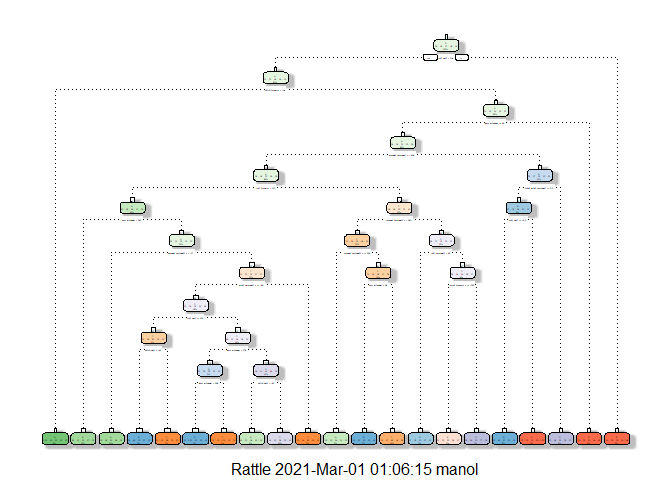

## Overview
This is the final report of the Peer Assessment project from Coursera’s course Practical Machine Learning, as part of the Specialization in Data Science. This analysis is meant to be the basis for the course quiz and a prediction assignment writeup. The purpose of the project is to predict the manner in which 6 participants performed some exercise as described below. This is the “classe” variable in the training set. The best performing machine learning algorithm is applied to the 20 test cases available in the test data and the predictions are submitted in appropriate format to the Course Project Prediction Quiz for automated grading.

## Load Libraries

```r
library(tidyverse)
library(caret)
library(randomForest)
library(rpart)
library(rpart.plot)
library(rattle)
library(gbm)
```
## Load Data & Clean

The pml-training.csv data is used to devise training and testing sets during fitting of the model.The pml-test.csv data is used to submit 20 test cases based on the fitted model.


```r
train_df<-read.csv("data/pml-training.csv",na.strings=c("NA","#DIV/0!", ""))
test_df <-read.csv("data/pml-testing.csv",na.strings=c("NA","#DIV/0!", ""))
```

Remove columns with more than 50% NA values and the index column


```r
var_sel<- which((colSums(!is.na(train_df))>=0.5*nrow(train_df)))

#Remove the index, time stamp and username columns
var_sel<-var_sel[-c(1:5)]

train_clean_na <- train_df[,var_sel]
test_clean_na  <- test_df [,var_sel]

#Make factor variables
train_clean_na<-mutate(train_clean_na,
                       classe=as.factor(classe))%>%
                select(-new_window)

test_clean_na <-select(test_clean_na,-new_window)
```

## Partition data into training and test set
Partition the training data into 60% training and 40% testing sets. There are 11776 in the training group, and 7846 in the testing group.


```r
in_train  <- createDataPartition(train_clean_na$classe,p = 0.6,list = FALSE)
training  <- train_clean_na[in_train, ]
testing   <- train_clean_na[-in_train, ]
```

## Model Selection

Three model types are tested to find the best out-of-sample accuracy.

* Random Forest
* Generallized Boosted model
* Decision Tree

### Fitting a Random Forest Model

```r
#5 folds repeat 2 times
set.seed(42)
control <- trainControl(method='repeatedcv', 
                        number=5, 
                        repeats=2)

rf_mod  <- train(classe ~ .,
                 data = training,
                 method = "rf",
                 trControl = control,
                 verbose = FALSE)
```
Predict on the test data


```r
pred_rf=predict(rf_mod,testing)
cm_rf  =confusionMatrix(pred_rf,testing$classe)
save(cm,file='confusion_matrix_rf.RData')
cm_rf
```

```
## Confusion Matrix and Statistics
## 
##           Reference
## Prediction    A    B    C    D    E
##          A 2232    2    0    0    0
##          B    0 1515    0    0    0
##          C    0    1 1368    7    0
##          D    0    0    0 1279    3
##          E    0    0    0    0 1439
## 
## Overall Statistics
##                                           
##                Accuracy : 0.9983          
##                  95% CI : (0.9972, 0.9991)
##     No Information Rate : 0.2845          
##     P-Value [Acc > NIR] : < 2.2e-16       
##                                           
##                   Kappa : 0.9979          
##                                           
##  Mcnemar's Test P-Value : NA              
## 
## Statistics by Class:
## 
##                      Class: A Class: B Class: C Class: D Class: E
## Sensitivity            1.0000   0.9980   1.0000   0.9946   0.9979
## Specificity            0.9996   1.0000   0.9988   0.9995   1.0000
## Pos Pred Value         0.9991   1.0000   0.9942   0.9977   1.0000
## Neg Pred Value         1.0000   0.9995   1.0000   0.9989   0.9995
## Prevalence             0.2845   0.1935   0.1744   0.1639   0.1838
## Detection Rate         0.2845   0.1931   0.1744   0.1630   0.1834
## Detection Prevalence   0.2847   0.1931   0.1754   0.1634   0.1834
## Balanced Accuracy      0.9998   0.9990   0.9994   0.9970   0.9990
```


```r
pred_test_rf=predict(rf_mod,test_clean_na)
save(pred_test_rf,file='pred_test_rf.RData')
```

### Fitting a Decision Tree Model

```r
set.seed(42)
dt_mod <- rpart(classe ~ ., data=training, method="class")
fancyRpartPlot(dt_mod)
```

<!-- -->
Predict on the test data


```r
pred_dt=predict(dt_mod,testing,type="class")
cm_dt  =confusionMatrix(pred_dt,testing$classe)
save(cm_dt,file='confusion_matrix_dt.RData')
cm_dt
```

```
## Confusion Matrix and Statistics
## 
##           Reference
## Prediction    A    B    C    D    E
##          A 1970  343   62  103   59
##          B   66  847   47   40   30
##          C   14   86 1103  186   86
##          D  128  164   73  829  168
##          E   54   78   83  128 1099
## 
## Overall Statistics
##                                          
##                Accuracy : 0.7453         
##                  95% CI : (0.7356, 0.755)
##     No Information Rate : 0.2845         
##     P-Value [Acc > NIR] : < 2.2e-16      
##                                          
##                   Kappa : 0.6767         
##                                          
##  Mcnemar's Test P-Value : < 2.2e-16      
## 
## Statistics by Class:
## 
##                      Class: A Class: B Class: C Class: D Class: E
## Sensitivity            0.8826   0.5580   0.8063   0.6446   0.7621
## Specificity            0.8990   0.9711   0.9426   0.9187   0.9464
## Pos Pred Value         0.7765   0.8223   0.7478   0.6087   0.7621
## Neg Pred Value         0.9506   0.9016   0.9584   0.9295   0.9464
## Prevalence             0.2845   0.1935   0.1744   0.1639   0.1838
## Detection Rate         0.2511   0.1080   0.1406   0.1057   0.1401
## Detection Prevalence   0.3233   0.1313   0.1880   0.1736   0.1838
## Balanced Accuracy      0.8908   0.7645   0.8744   0.7817   0.8543
```


```r
pred_test_dt=predict(dt_mod,test_clean_na,type="class")
save(pred_test_dt,file='pred_test_dt.RData')
```


### Fitting a Gradient Boosted Model

```r
#5 folds repeat 2 times
set.seed(42)
control_gbm <- trainControl(method='repeatedcv', 
                        number=5, 
                        repeats=2)

gbm_mod  <- train(classe ~ .,
                  data = training,
                  method = "gbm",
                  trControl = control_gbm,
                  verbose = FALSE)
```
Predict on the test data

```r
pred_gbm=predict(gbm_mod,testing)
cm_gbm  =confusionMatrix(pred_gbm,testing$classe)
save(cm_gbm,file='confusion_matrix_gbm.RData')
cm_gbm
```

```
## Confusion Matrix and Statistics
## 
##           Reference
## Prediction    A    B    C    D    E
##          A 2229    9    0    3    0
##          B    2 1496    5    2    3
##          C    1   12 1361    9    2
##          D    0    1    2 1269   14
##          E    0    0    0    3 1423
## 
## Overall Statistics
##                                          
##                Accuracy : 0.9913         
##                  95% CI : (0.989, 0.9933)
##     No Information Rate : 0.2845         
##     P-Value [Acc > NIR] : < 2.2e-16      
##                                          
##                   Kappa : 0.989          
##                                          
##  Mcnemar's Test P-Value : NA             
## 
## Statistics by Class:
## 
##                      Class: A Class: B Class: C Class: D Class: E
## Sensitivity            0.9987   0.9855   0.9949   0.9868   0.9868
## Specificity            0.9979   0.9981   0.9963   0.9974   0.9995
## Pos Pred Value         0.9946   0.9920   0.9827   0.9868   0.9979
## Neg Pred Value         0.9995   0.9965   0.9989   0.9974   0.9970
## Prevalence             0.2845   0.1935   0.1744   0.1639   0.1838
## Detection Rate         0.2841   0.1907   0.1735   0.1617   0.1814
## Detection Prevalence   0.2856   0.1922   0.1765   0.1639   0.1817
## Balanced Accuracy      0.9983   0.9918   0.9956   0.9921   0.9932
```


```r
pred_test_gbm=predict(gbm_mod,test_clean_na)
save(pred_test_gbm,file='pred_test_gbm.RData')
```

## Summarise different models
The model that performed the best on the test data sample is the Random Forest model.

```r
data.frame(model=c("RandomForest","DecisionTree","GradientBoosted"),
           test_accuracy=c(cm_rf$overall['Accuracy'],
                           cm_dt$overall['Accuracy'],
                           cm_gbm$overall['Accuracy']))
```

```
##             model test_accuracy
## 1    RandomForest     0.9983431
## 2    DecisionTree     0.7453479
## 3 GradientBoosted     0.9913332
```

## Make predictions with the Random Forest Model.
The Random Forest model is selected and applied to make predictions on the 20 data points from the original testing dataset.


```r
pred_test_rf
```

```
##  [1] B A B A A E D B A A B C B A E E A B B B
## Levels: A B C D E
```


